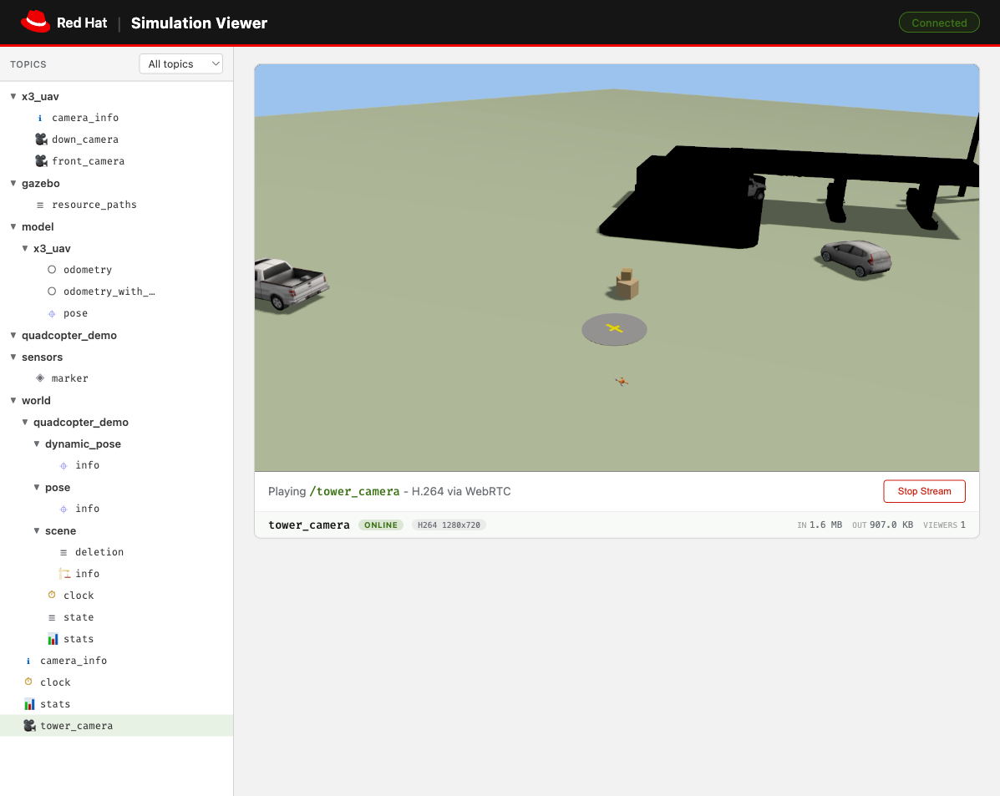

# gz-camera-stream

A Gazebo Sim plugin that streams H.264 video from camera sensors to a [MediaMTX](https://github.com/bluenviron/mediamtx) server via WebRTC (WHIP). Viewers connect through a browser and receive low-latency WebRTC video without any additional software.

The plugin is idle by default and activates on demand - when a viewer requests a camera stream, the plugin starts encoding and pushing video. When all viewers disconnect, encoding stops. Multiple cameras can stream simultaneously, each on its own encoder thread.



## How it works

```
Gazebo (render)  -->  CameraStream plugin (H.264)  --WHIP-->  MediaMTX  --WebRTC-->  Browser
```

1. Gazebo renders camera frames using OGRE2
2. The plugin copies each frame from the GPU, converts RGB to YUV420P, and encodes H.264 with libx264 (ultrafast/zerolatency)
3. Encoded packets are pushed to MediaMTX over WHIP (WebRTC HTTP Ingest Protocol)
4. MediaMTX serves the stream to browsers via WebRTC, with automatic conversion to HLS/RTSP/RTMP if needed

## Requirements

- [Gazebo Sim](https://gazebosim.org/) (Rotary distribution / gz-sim 11)
- [MediaMTX](https://github.com/bluenviron/mediamtx) v1.18+
- FFmpeg 8.x with WHIP muxer and libx264 (Homebrew `ffmpeg` includes both - verify with `ffmpeg -muxers | grep whip`)
- macOS (Apple Silicon) or Linux

## Quick start

### 1. Build the plugin

**macOS (Homebrew):**

```bash
cd gz-camera-stream
cmake -B build -DCMAKE_PREFIX_PATH=/opt/homebrew
cmake --build build
cp build/libgz-sim-camera-stream-system.dylib /opt/homebrew/lib/
```

**Linux:**

```bash
cd gz-camera-stream
cmake -B build
cmake --build build
sudo cp build/libgz-sim-camera-stream-system.so /usr/local/lib/
```

### 2. Start MediaMTX

```bash
mediamtx mediamtx-gazebo.yml
```

### 3. Launch the simulation

**macOS:**

```bash
GZ_SIM_SYSTEM_PLUGIN_PATH=/opt/homebrew/lib \
  gz sim -s -r --headless-rendering quadcopter_demo.sdf -v 4
```

**Linux:**

```bash
GZ_SIM_SYSTEM_PLUGIN_PATH=/usr/local/lib \
  gz sim -s -r --headless-rendering quadcopter_demo.sdf -v 4
```

> **Note:** `quadcopter_demo.sdf` references the X3 UAV model from [Gazebo Fuel](https://fuel.gazebosim.org/). The first run will download it automatically - this requires a network connection and may take a moment.

### 4. Open the viewer

Serve `viewer.html` locally and open it in a browser:

```bash
python3 -m http.server 8080
open http://localhost:8080/viewer.html
```

The viewer connects to Gazebo's WebSocket server on port **9002** and MediaMTX on port **8889**. Both must be reachable from the browser - if running on a remote host, update the addresses in `viewer.html`. The viewer auto-discovers available cameras and starts streaming the first one it finds.

### 5. Fly the quadcopter (optional)

```bash
# Manual takeoff
gz topic -t "/X3/gazebo/command/twist" -m gz.msgs.Twist \
  -p "linear: {z: 0.5}"

# Autonomous patrol
./fly_patrol.sh
```

## SDF configuration

Add the plugin to any Gazebo world:

```xml
<plugin filename="gz-sim-camera-stream-system"
        name="gz::sim::systems::CameraStream">
  <topic>/stream/control</topic>
  <default_bitrate>4000000</default_bitrate>
  <default_fps>30</default_fps>
</plugin>
```

| Parameter | Default | Description |
|-----------|---------|-------------|
| `topic` | `/stream/control` | gz-transport topic and service for stream control |
| `default_bitrate` | `4000000` | H.264 encoding bitrate in bps |
| `default_fps` | `30` | Encoding framerate |

## Stream control

Start and stop streams by publishing `gz.msgs.StringMsg_V` to the control topic:

```bash
# Start streaming a camera to MediaMTX
gz topic -t /stream/control -m gz.msgs.StringMsg_V \
  -p 'data: "start" data: "camera_name" data: "http://localhost:8889/stream_path/whip"'

# Stop
gz topic -t /stream/control -m gz.msgs.StringMsg_V \
  -p 'data: "stop" data: "camera_name"'
```

The viewer handles this automatically through the sidebar UI.

## Camera naming and MediaMTX path matching

The included `mediamtx-gazebo.yml` matches paths using the regex `~^(cam.+)$`, which covers names like `camera`, `cam1`, `cam_front`, and `cam_down`. Camera names that do not start with `cam` (e.g., `front`, `overhead`, `drone`) will not be picked up by this pattern - MediaMTX will accept the viewer connection but will never trigger the demand hook, so no stream starts.

To support other naming schemes, edit the path key in `mediamtx-gazebo.yml`:

```yaml
# Match any camera name
~^(.+)$:
  runOnDemand: ...

# Or match specific names
front_camera:
  runOnDemand: ...
overhead:
  runOnDemand: ...
```

If you use a catch-all pattern (`~^(.+)$`), be aware it will trigger for any path a viewer requests, including typos.

## Project structure

```
gz-camera-stream/
  CMakeLists.txt            Standalone CMake build
  viewer.html               Web UI (topic tree, camera selector, WebRTC player)
  mediamtx-gazebo.yml       MediaMTX config (IPv4 loopback, demand-based paths)
  quadcopter_demo.sdf       Demo world: X3 UAV, 3 cameras, ground objects
  headless_camera.sdf       Minimal test world: spinning arm, static camera
  fly_patrol.sh             Autonomous flight script for the X3 UAV
  src/
    CameraStream.hh/.cc     World-level system plugin (control topic, PostRender)
    StreamContext.hh/.cc     Per-stream FFmpeg encoder + WHIP output
    FrameQueue.hh            Lock-free SPSC ring buffer (render thread -> encoder)
  docs/
    viewer-screenshot.png    UI screenshot
```

## Architecture

- **One encoder thread per stream** - no stream waits for another's encode. Threads sleep on a condition variable between frames (near-zero CPU when idle).
- **Frame dropping over blocking** - if the encoder falls behind, the oldest frame in the 3-frame ring buffer is overwritten rather than stalling the render thread.
- **WHIP with RTSP fallback** - auto-detects FFmpeg WHIP muxer availability. Pass an `rtsp://` URL to use RTSP instead.
- **Write-failure auto-stop** - if MediaMTX goes away, the plugin detects consecutive write failures and stops the stream automatically.
- **Sensor name matching** - cameras can be requested by short name (e.g., `camera`) and the plugin resolves it against the full scoped sensor name in the rendering scene (e.g., `tower_camera::link::tower_camera`).

## Included demo worlds

### `quadcopter_demo.sdf`

X3 UAV quadcopter from [Gazebo Fuel](https://fuel.gazebosim.org/) with velocity control, three cameras (front-facing 1280x720, downward 640x480, tower overview 1280x720), ground objects (gas station, vehicles, warehouse, water tower), and a landing pad. Controllable via Twist commands.

### `headless_camera.sdf`

Minimal test scene with a spinning arm, falling shapes, and a single static camera. Useful for verifying the streaming pipeline works.

## License

Apache License 2.0
